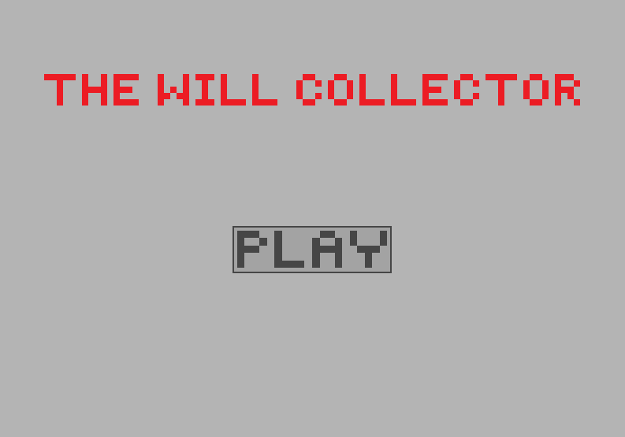

<h1 align="center">
    

        BUAS - Intake Project
    

    

        The Will Collector
    

</h1>

A game made for the intake assignment of CMGT at the BUAS 24-25 in the direction of programming. 

    <a href="#Story">Story</a>
    ·
    <a href="#Features">Features</a>
    ·
    <a href="#Download">Download</a>
    ·
    <a href="#How to play!">How to play!</a>
    ·
    <a href="#Credits">Credits</a>

  

## Story
In the dimly lit corridors of the ancient dungeon, a lone figure moved silently through the shadows. This was no ordinary adventurer; you are _The Will Collector_, the last survivor of a once-vibrant party of daring dungeon delvers. You have a solemn duty to fulfill.

Your party had been the best in the business, renowned for their courage and skill. But their last expedition had gone horribly wrong. A powerful enchantment had been triggered, sealing the entrance behind them and scattering your companions' lifeless bodies throughout the labyrinthine depths of the dungeon.

As _The Will Collector_, it is your responsibility to recover the wills of your fallen comrades and bring them back to their grieving families. It is a task of utmost importance, for the wills contain not only the wishes and final thoughts of the deceased but also the key to their family's future.

You crept silently through the darkness, your footsteps barely making a sound on the cold, stone floor. You know that the dungeon was far from empty; dangerous creatures and traps lurked around every corner. But you are skilled in the art of stealth, and your years of experience had made you a master of evasion.

The first will is hidden deep within a chamber filled with sinister traps. You retrieve the parchment bearing your comrade's final wishes. You carefully place it in a pouch at your side, a solemn reminder of the lives lost.

Each will was a piece of the puzzle, guiding you deeper into the dungeon's treacherous heart. But your determination never wavered, and you pressed on, honoring the memory of your fallen friends.

As you venture further into the abyss, you couldn't help but reminisce about your party's past adventures. The laughter, the camaraderie, and the shared triumphs fueled your resolve. You would not let their deaths be in vain.

Now bearing the weight of your party's collective wishes and dreams. The journey is treacherous, but you are driven by the knowledge that you are their last hope.

Finally, you emerged into the daylight, carrying the precious wills of you fallen comrades. You fulfilled your solemn duty, delivering each will to its rightful family. The tears, smiles, and gratitude of those you met are a bittersweet reward.

Though your party is gone, their memory lived on in the hearts of those they had touched. You, _The Will Collector_, ensure that their final wishes are granted, and that their legacy would endure. In the end, you not only collected their wills but also preserved their spirit of adventure and camaraderie for generations to come.

## Features
1. movement <kbd>W</kbd> <kbd>A</kbd> <kbd>S</kbd> <kbd>D</kbd>  and <kbd>arrow-keys</kbd>
2. player collisions between walls, the window, enemies and the will
3. the collection of the will's a the fallen party members
4. a line of sight system
5. patroling enemies
6. an UI featuring a level and health tracker
7. an easy, normal and hard difficulty mode
8. 3 levels per difficulty mode
9. traps that deal 1 heart of damage
10. enemies that can spot you causing an instant game over
11. a main menu containing the title
12. a difficulty mode selection screen
13. a story line

## Download
1. go to [releases][4]
2. Download the zip file
3. Extract the files from the zip file
4. Open the file called "The_Willcollector_x64.exe"

## How to play!
Open the .exe file, this will send you to the main menu. Press play and choose a difficulty mode (if you want to go back to the main menu while in the difficulty screen press <kbd>Backspace</kbd>). You can use the <kbd>W</kbd> <kbd>A</kbd> <kbd>S</kbd> <kbd>D</kbd> or <kbd>Arrow Up</kbd> <kbd>Arrow Down</kbd> <kbd>Arrow Left</kbd> <kbd>Arrow Right</kbd> to move around.
Collect the Wills (the scroll) of your fallen comrades to proceed to the next level while avoiding potential traps and enemies that may be there as well.

## Credits
thank you:
* [Snoblinart][1] for the skeleton sprite and heart sprites
* [Anokolisa][2] for the trap sprite
* [RunninBlood][3] for the player sprite

[1]: https://snoblin.itch.io
[2]: https://twitter.com/Anokolisa
[3]: https://twitter.com/RunninBlood
[4]:https://github.com/TygovGorp/CollectGame/releases
